# Employee Management System

A Node.js and Express course-end project for managing employee records through a browser-based EJS interface and REST-style API routes.

The application supports user sign-up and login, employee creation, employee directory viewing, employee updates, employee deletion, JSON-file storage, Postman API testing, and Cypress end-to-end testing.

---

## Project Overview

The Employee Management System was developed as a backend-focused Node.js project.

Express.js is used to handle server routes, EJS renders dynamic HTML pages, the Node.js `fs` module reads and writes JSON data, and `cookie-parser` reads login information stored in browser cookies.

Employee records can be managed through:

1. A browser-based EJS interface
2. REST-style API routes tested with Postman

---

## Features

### Authentication

- Admin login
- New account registration
- Duplicate account detection
- Invalid credential handling
- Logged-in user email stored in a cookie

### Employee Management

- View all employee records
- Add new employees
- Edit existing employees
- Delete employees
- Generate employee IDs automatically
- Prevent duplicate employee email addresses
- Display the current employee count

### Testing

- REST API testing with Postman
- Cypress end-to-end testing
- Visual Cypress test execution

---

## Technologies Used

- Node.js
- Express.js
- EJS
- JavaScript
- HTML
- CSS
- Node.js `fs` module
- `cookie-parser`
- JSON
- Cypress
- Postman
- npm
- Git and GitHub

---

## Application Structure

```text
node_backend_course_end_project/
├── cypress/
│   ├── e2e/
│   │   └── ems.cy.js
│   └── support/
├── documents/
│   ├── Screenshots_Employee_Management_System.docx
│   ├── Screenshots_Employee_Management_System.pdf
│   ├── Source_Code_GitHub_Employee_Management_System.docx
│   ├── Source_Code_GitHub_Employee_Management_System.pdf
│   ├── WRITEUP_Employee_Management_System.docx
│   └── WRITEUP_Employee_Management_System.pdf
├── public/
│   └── css/
│       └── styles.css
├── screenshots/
│   ├── add-employee.png
│   ├── cypress-testing-results.png
│   ├── employee-directory.png
│   ├── login.png
│   ├── manage-employees.png
│   ├── manage-employees-edit.png
│   ├── postman-delete.png
│   ├── postman-get-all.png
│   ├── postman-get-one.png
│   ├── postman-patch.png
│   ├── postman-post.png
│   └── signup.png
├── views/
│   ├── addEmployee.ejs
│   ├── employees.ejs
│   ├── login.ejs
│   ├── manageEmployees.ejs
│   └── signUp.ejs
├── .gitignore
├── app.js
├── cypress.config.js
├── employees.json
├── logins.json
├── package.json
├── package-lock.json
└── README.md
```

---

## How to Run the Project

### Prerequisites

Install:

- Node.js
- npm

Verify the installations:

```bash
node --version
npm --version
```

### 1. Clone the repository

```bash
git clone <repository-url>
```

### 2. Open the project folder

```bash
cd node_backend_course_end_project
```

### 3. Install dependencies

```bash
npm install
```

### 4. Start the server

```bash
node app.js
```

The terminal should display:

```text
Server is running on port number 5000
```

### 5. Open the application

```text
http://localhost:5000
```

### Demo Login

Use a demo account stored in `logins.json`.

```text
Email: admin@email.com
Password: password123
```

The credentials are for demonstration and educational purposes only.

---

## Screenshots

### Login

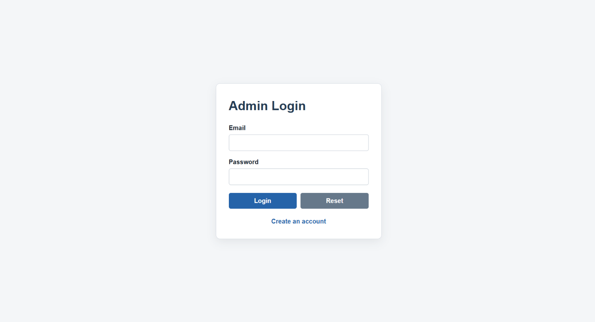

### Sign Up

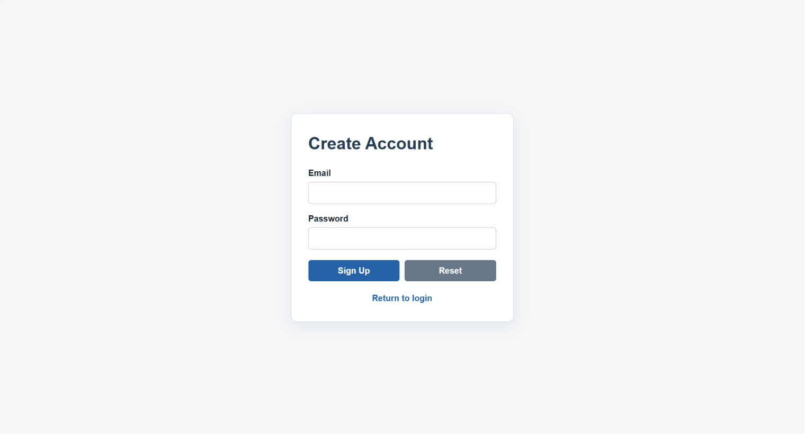

### Employee Directory

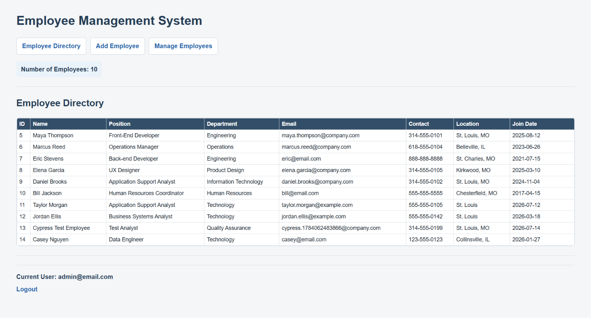

### Add Employee

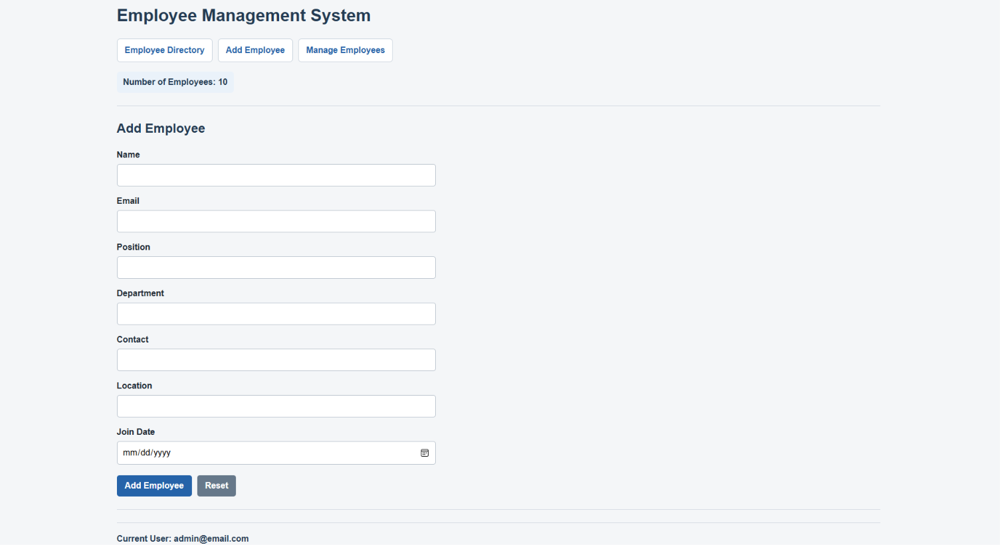

### Manage Employees

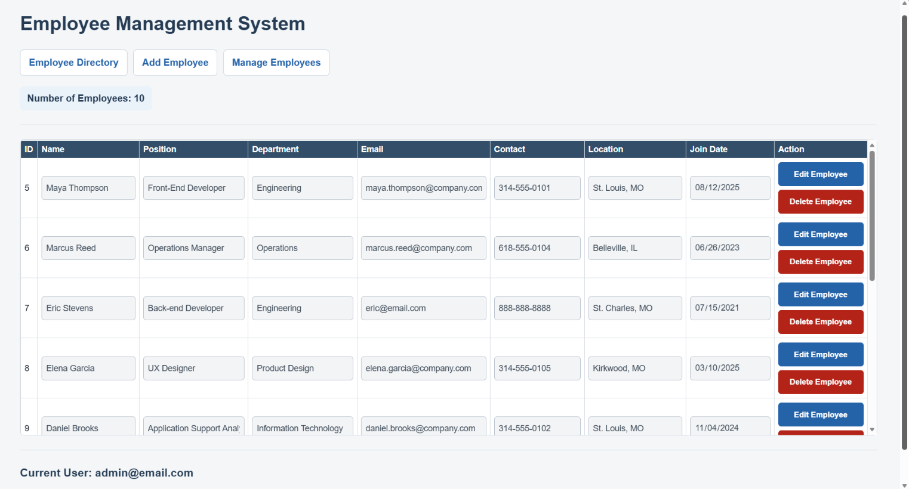

### Manage Employees — Edit Mode

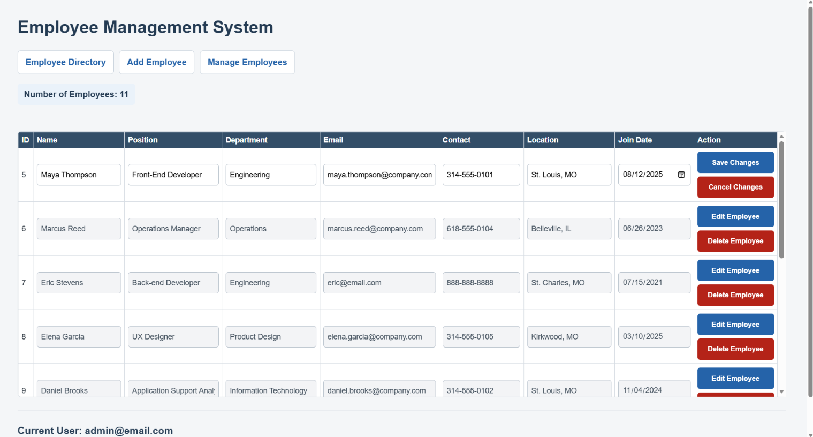

### Postman — Read All Employees

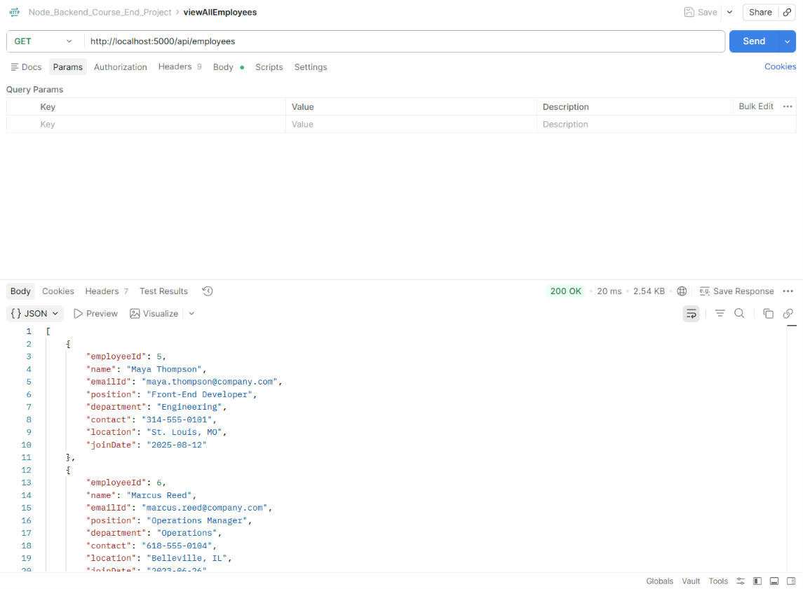

### Postman — Read One Employee

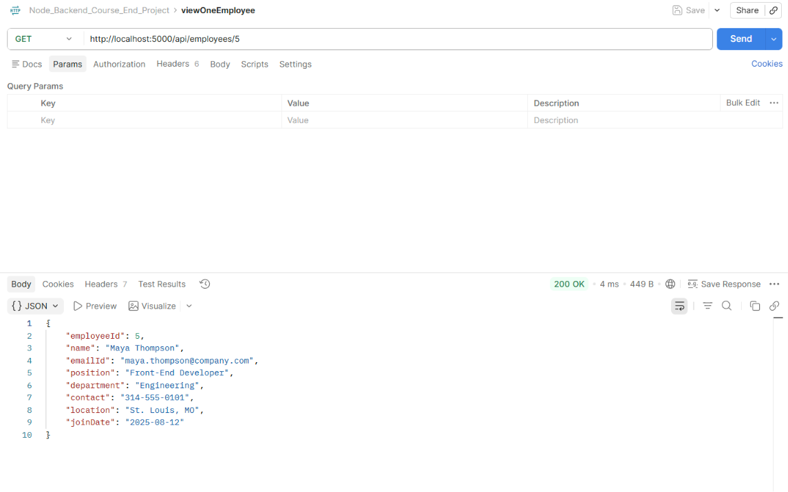

### Postman — Create Employee

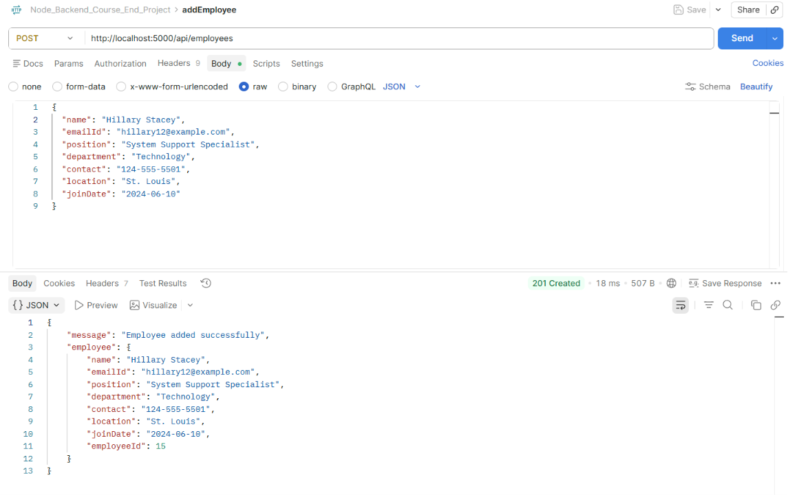

### Postman — Update Employee

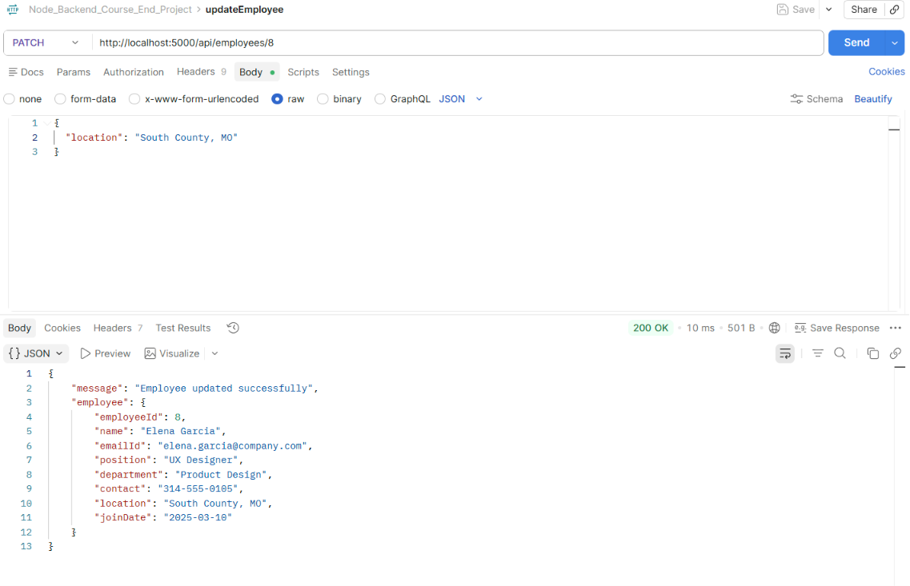

### Postman — Delete Employee

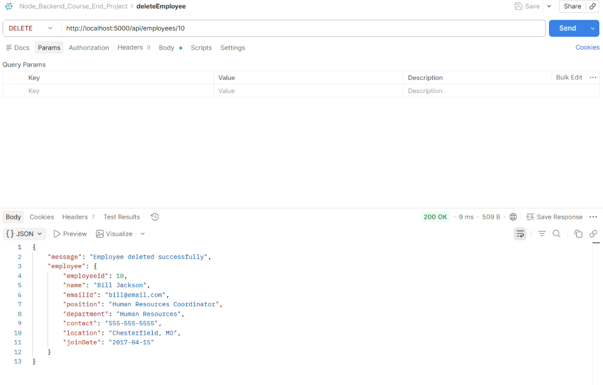

### Cypress Test Results

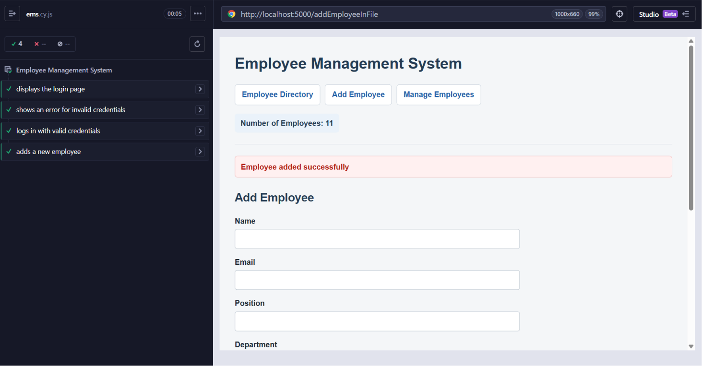
